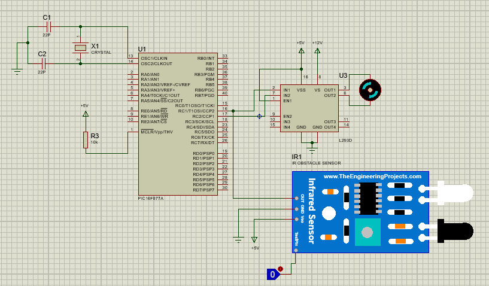

# Microprocessors and Interfacing: Infrared Sensor & DC Motor with PIC16F877A
This repository contains a microprocessor interfacing project that demonstrates **automatic motor control using an Infrared (IR) sensor** with the **PIC16F877A** microcontroller. The project is implemented using **Proteus 8.10** for simulation and **CCS C Compiler** for code development.

## Repository Structure:

```bash
📂 Microprocessors_and_Interfacing_IR_Motor_PIC16
├── 📂 HexFile
│   ├── InfraredSensorsTEP.HEX
│   ├── main.hex
├── 📂 SourceCode
│   └── main.c
├── 📂 ProteusProject
│   └── IR-Motor-PIC16.pdsprj
├── 📂 Documentation
│   ├── Project Report 2.pdf
│   ├── Circuit_Diagram.png
├── LICENSE
├── README.md
└── requirements.txt


```

## Table of Contents

- [Project Overview](#project-overview)
- [Circuit Diagram](#circuit-diagram)
- [Installation](#installation)
- [Usage](#usage)
- [Software and Tools](#software-and-tools)
- [Dependencies](#dependencies)
- [Authors](#authors)
- [License](#license)

## Project Overview

This project involves interfacing an **Infrared (IR) sensor** with a **PIC16F877A microcontroller** to control a **DC motor**. The system operates as follows:

- **IR Sensor Detects Object (Logical 1)** → Motor **Starts**
- **IR Sensor Doesn't Detect Object (Logical 0)** → Motor **Stops**

This mechanism allows for **automated motor control** based on the presence or absence of objects in the sensor's range.

## **Circuit Diagram**


## **Installation**
### **1. Clone the Repository**
```bash
git clone https://github.com/Kaleabt37/Microprocessors_and_Interfacing_IR_Motor_PIC16.git
cd Microprocessors_and_Interfacing_IR_Motor_PIC16
```
### **2. Open the Proteus Project**

- Navigate to the ProteusProject folder
- Open the IR-Motor-PIC16 project file in Proteus

### **3. Load the HEX File**

- In Proteus, double-click the PIC16F877A microcontroller
- In the Program File section, click the folder icon
- Navigate to HexFile/ and select the InfraredSensorsTEP.HEX or main.hex file

### **4. Run the Simulation**

- Click Run Simulation and observe the IR sensor controlling the motor


## **Usage**
### **1. Microcontroller Behavior**

- IR Sensor-Based Motor Control:
  - Object Detected (Logical 1) → Motor Starts  
  - No Object Detected (Logical 0) → Motor Stops  

### **2. How to Modify the Code**

- Open the main.c file located in SourceCode/
- Modify the logic inside main.c as needed
- Recompile the code using CCS C Compiler
- Generate a new HEX file and update the Proteus simulation


## **Software and Tools**
```bash
|   Software     |            Purpose           |
|----------------|------------------------------|
| Proteus 8.10   | Circuit simulation           |
| CCS C Compiler | Writing and compiling C code |
```

## **Dependencies**

- This project requires the following tools:
  - Proteus 8.10 (for circuit design and testing)
  - CCS C Compiler (for developing and compiling the C code)

## **Authors**

- This project was developed by Kaleab Tesfaye


## **License**

- This project is licensed under the MIT License – see the LICENSE file for details.

